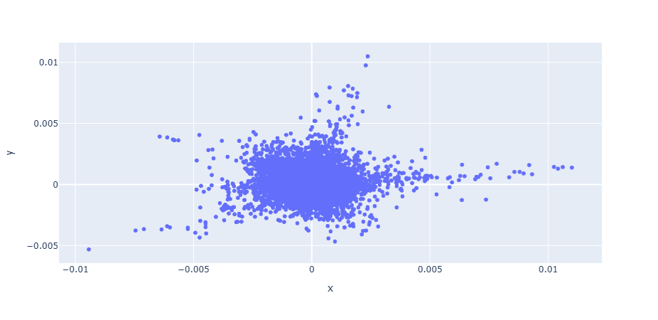

## Spotify User–Song Graph Analysis

### Overview

This project explores music recommendation and genre discovery using a dataset of Spotify listening events.  The data comes from the dataset published on Kaggle: https://www.kaggle.com/datasets/andrewmvd/spotify-playlists/data

Each record in the source dataset states that at some point the user was listening to a specific song. The user opted in to have their currently-playing song visible in an app such as Discord. Playlist names were also captured but have not been used in this project.

This relationship naturally defines a bipartite graph connecting users and songs.
The aim was to investigate whether this graph structure could be leveraged to derive useful representations for recommendation or genre inference.

### Data cleaning and transformation
* The data was provided in one compressed CSV table. There were some formatting issues: contrary to the description special characters like double-quote and comma were not escaped in the CSV file and do occasionally occur in song titles. Fortunately the correct titles were recoverable using a series of global substring replacements.
* After the above fix to the title strings, no other missing or invalid values were found.
* Duplicate entries were removed. That is, listens of the same song by the same user at different times.
  * We did not consider whether a user listened to the same song as part of two or more playlists.
* No further lossy transformations were employed.
* We then constructed an invertible label encoding to replace each unique user, song and artist name
  with a numeric ID. These IDs were used in the following matrix operations and an index file was generated to map the IDs back to names for visualization purposes.
    * The code for this is similar to Pandas's `factorize` method, but avoids storing the untransformed table in main memory by only decompressing one row at a time and saving only those user, artist and song names that have not been seen before. Playlist names are discarded immediately. This has been tested on a consumer laptop with 16GB main RAM.
* The dataset was further filtered to include only songs that had been listened to by at least 200 users. This number was determined by experimentation to allow the entire matrix to be processed in-place in a reasonable time.

### Spectral embedding method

The key algorithm used here is Spectral Embedding.

This stage involves computing a spectral embedding of the user–song graph.
This produces coordinates in a continuous vector space for both users and songs, allowing relationships such as similarity or clustering to be expressed geometrically.

This process is unsupervised and does not rely on any labelling. However it could be useful in visualisations to highlight groups of nodes with known features such as songs by one of a few well-known artists, or to colour points based on the assigned genre of a song in the Spotify database.

An affinity estimate (e.g. using Random Forests) was not necessary here as the provided data already contains (only) affinities.

Notably users and songs are transformed to points in the same space, so clusters assigned to songs would result in users being inferred to be members of the same clusters and vice-versa.

### Clustering and Genre Inference

The next step was to apply a clustering algorithm to the embedded vectors in order to:

* Group songs into inferred “genres” or stylistic clusters. The word "genre" is used loosely here because although canonical genre labels are available through a separate API they were not directly used in this model.
* Identify user communities with similar listening patterns
* Evaluate potential for recommendation via nearest-neighbour lookup

Our main hypothesis is that a fairly small number of clusters (correlated with musical genres but not exactly equivalent to them) should almost as effective for recommendations as a larger number of clusters or another model such as a naive Bayes classifier over the full dataset.
The attempts to divide songs into a relatively small number of clusters, similarly divide users into  clusters and assign to each user cluster a numeric affinity for each song cluster, and predict other songs that the same user would be likely to enjoy as a cosine similarity measure between vectors of those numeric affinities.

### Challenges
The main obstacle was dataset size and computational limits.
The provided dataset if naively loaded into a dense structure such as a Pandas DataFrame is large enough to exceed the memory capacity of a consumer laptop with 16GB of RAM running Windows 11.
To mitigate this, several memory-reduction strategies were explored:

1. Label encoding, whereby each song, artist and user name is replaced by a sequential integer during processing of the core algorithm.  This step itself has significant memory requirements as it is necessary to maintain a dictionary of artist and song names that have been seen before, so repeated occurrences can be assigned the same ID.  
The numerically-labelled songs were saved to a temporary file that could be processed later, with the dictionary no longer needing to be in memory.
2. Sampling subsets of songs
    * The code as implemented allows a threshold to be given; Only songs with at least this many unique listeners are passed to the spectral embedding stage. It was hoped this could be set fairly low.  Out of 2.8 million songs in the dataset, slightly fewer than 4,000 have at least 200 listeners. This size proved manageable for the available hardware but it would be desirable to find a way to increase this (by lowering the threshold) 
3. Sparse matrix representations for the adjacency structure and incremental computation of Laplacian eigenvectors.
    * These techniques are implemented in Scikit-Learn and make it possible to process far larger datasets than would be possible with dense matrices.
    * This part, once the size and hence memory requirements are reduced, runs reasonably quickly.

These optimizations reduced resource use significantly, but at the cost of development time that would otherwise have gone into analysis and visualization.

### Future Work
* Apply a train/test split to the set of users
* Evaluate recommendation quality using a few different models
  * Cosine similarity between a small number of user clusters and song clusters
* Experiment with alternative embedding methods (node2vec, isomap embedding, graph neural networks).
* Scale to larger subsets using cloud or distributed computing resources.
* Incorporate additional features which are not present in the published dataset but could be obtained via public APIs; This includes genres associated with artists. The study that the dataset was originally captured for also suggested playlist names could be a useful feature for classification. This would require an algorithm that can also consider edge weights, to allow for multiple artists per song and multiple genres per artist.

#### Acknowledgments
Dataset: Spotify listening events (public research dataset): https://www.kaggle.com/datasets/andrewmvd/spotify-playlists/data  
Tools: Python, NumPy, SciPy, scikit-learn, Plotly.
